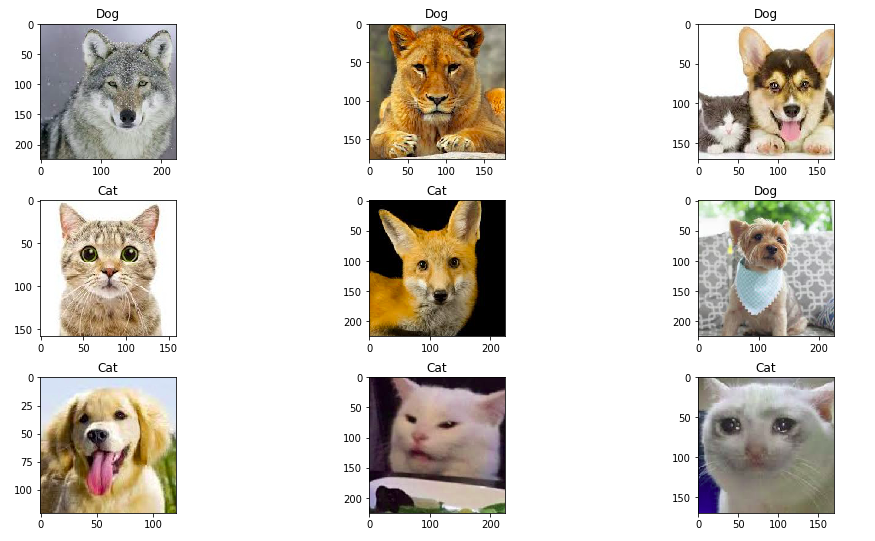

# CNN-Differentiate between Dogs and cats
A CNN model made using keras to differentiate between the images of Cats and Dogs.

## Classes in the dataset:
1. Cat
2. Dog

## Summary of Model:

Model: "sequential"

| Layer (type)                |  Output Shape         |  Parameters |
| :-------------------------: | :-------------------: | :---------: |
| conv2d13 (Conv2D)           | (None, 75, 75, 32)    |   320       |
| activation18 (Activation)   | (None, 75, 75, 32)    |   0         |
| batchnormalization15        | (None, 75, 75, 32)    |   128       |
| conv2d14 (Conv2D)           | (None, 75, 75, 32)    |   9248      |
| activation19 (Activation)   | (None, 75, 75, 32)    |   0         |
| batchnormalization16        | (None, 75, 75, 32)    |   128       |
| maxpooling2d6 (MaxPooling2  | (None, 37, 37, 32)    |   0         |
| dropout9 (Dropout)          | (None, 37, 37, 32)    |   0         |
| conv2d15 (Conv2D)           | (None, 37, 37, 64)    |   18496     |
| activation20 (Activation)   | (None, 37, 37, 64)    |   0         |
| batchnormalization17        | (None, 37, 37, 64)    |   256       |
| conv2d16 (Conv2D)           | (None, 37, 37, 64)    |   36928     |
| activation21 (Activation)   | (None, 37, 37, 64)    |   0         |
| batchnormalization18        | (None, 37, 37, 64)    |   256       |
| maxpooling2d7 (MaxPooling2  | (None, 18, 18, 64)    |   0         |
| dropout10 (Dropout)         | (None, 18, 18, 64)    |   0         |
| flatten3 (Flatten)          | (None, 20736)         |   0         |
| dense6 (Dense)              | (None, 64)            |   1327168   |
| activation22 (Activation)   | (None, 64)            |   0         |
| batchnormalization19        | (None, 64)            |   256       |
| dropout11 (Dropout)         | (None, 64)            |   0         |
| dense7 (Dense)              | (None, 1)             |   65        |
| activation23 (sigmoid)      | (None, 1)             |   0         |

Total params: 1,393,249
Trainable params: 1,392,737
Non-trainable params: 512

## Accuracy of model:
### 0.6268
### On test dataset : 0.4967869500741473

## Test Output:
